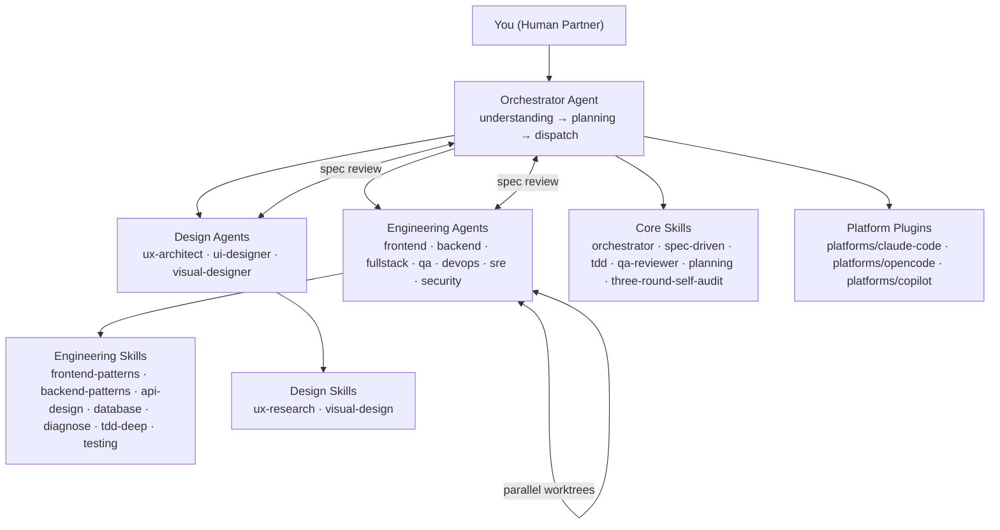

# AI Dev Team Framework

A complete AI software development team framework that works across **VS Code Copilot**, **OpenCode**, **Claude Code**, and any Claude/MCP-compatible tool.

Inspired by: [superpowers](https://github.com/obra/superpowers) · [OpenSpec](https://github.com/Fission-AI/OpenSpec) · [mattpocock/skills](https://github.com/mattpocock/skills) · [agency-agents](https://github.com/msitarzewski/agency-agents) · [Aperant](https://github.com/AndyMik90/Aperant)

## What It Is

An **Orchestrator-First** AI development team where a coordinating agent dispatches specialized engineering and design agents to execute tasks in parallel worktrees, following a spec-driven workflow with built-in QA gates.

## Architecture



### Core Principle: Orchestrator First

The Orchestrator never codes directly. It decomposes, delegates, and reviews.

## Directory Structure

```
ai-dev-team-framework/
├── README.md                    # This file
├── CLAUDE.md                    # For AI coding agents
├── AGENTS.md                    # For AI agent-to-agent communication
├── skills/                      # Tool-agnostic skill definitions
│   ├── core/                   # Core workflow skills
│   ├── engineering/            # Engineering skills
│   ├── design/                 # Design skills
│   └── mattpocock/            # Upstream integration manifest
├── agents/                     # Agent definitions
│   ├── orchestrator/
│   ├── engineering/
│   └── design/
├── specs/
│   └── templates/
├── platforms/                  # Tool-specific integrations (isolated — no cross-contamination)
│   ├── claude-code/            # Claude Code plugin
│   ├── copilot/                # VS Code Copilot plugin
│   └── opencode/               # OpenCode plugin
├── .ai-dev/                    # Framework self-maintenance
└── scripts/
    ├── install.sh
    └── test-structure.sh       # YAML frontmatter validator (0 errors)
```

## Quick Start

Each platform has its own isolated integration in `platforms/`. See the relevant section below.

## Core Workflow

### The 5-Phase Pipeline

```
1. ORCHESTRATE    ← Understand task, assess complexity, assign role
        ↓
2. SPEC           ← Write spec (OpenSpec-style artifact)
        ↓
3. PLAN           ← Break spec into independent tasks
        ↓
4. BUILD          ← Subagents implement in parallel worktrees
        ↓
5. QA GATE        ← QA reviewer validates, fixer resolves issues
```

### Per-Task Subagent Pattern

Each task in the plan gets a **fresh subagent** with:
- Isolated context (never inherits orchestrator's session history)
- Complete goal + acceptance criteria
- Relevant skill loaded
- Two-stage review: spec compliance → code quality

## Engineering Agents

| Agent | Specialty | Best For |
|-------|-----------|----------|
| `frontend-developer` | React/Vue/HTML-CSS | UI features, components, responsive |
| `backend-developer` | APIs, databases, services | Server logic, data pipelines |
| `fullstack-developer` | End-to-end features | APIs + UI together |
| `qa-engineer` | Test strategy, automation | Test suites, E2E, coverage |
| `devops-engineer` | CI/CD, infra, containers | Deployments, pipelines |

## Design Agents

| Agent | Specialty | Best For |
|-------|-----------|----------|
| `ux-architect` | User research, information architecture | Wireframes, flows, personas |
| `ui-designer` | Visual components, design systems | UI specs, component libraries |
| `visual-designer` | Graphics, branding, illustration | Icons, illustrations, branding |

## Skills (Composable Units)

Core skills are tool-agnostic and work with any AI coding harness:

| Skill | Purpose | When |
|-------|---------|------|
| `orchestrator` | Central coordination logic | Every task |
| `spec-driven` | Spec writing and review | New features |
| `subagent-driven` | How to dispatch subagents | Parallel work |
| `tdd` | Test-first development | All implementation |
| `qa-reviewer` | Validation gate | After each task |
| `planning` | Task breakdown | Plan phase |
| `three-round-self-audit` | Quality self-check | Before delivery |

## Multi-Platform Support

Each platform is fully isolated in `platforms/<name>/`. No shared directories, no cross-contamination.

### Claude Code

```bash
# Project-level
cp -r platforms/claude-code/skills/ /path/to/project/.claude/skills/ai-dev-team/

# Or run install script
./platforms/claude-code/install.sh /path/to/project
```

Skills are standalone Claude Code skills. Auto-discovered from `~/.claude/skills/`.

See `platforms/claude-code/SKILL.md` for full documentation.

### VS Code Copilot

```bash
# Project-level
cp -r platforms/copilot/commands/ /path/to/project/.claude/
cp -r platforms/claude-code/skills/ /path/to/project/.claude/skills/ai-dev-team/

# Or run install script
./platforms/copilot/install.sh /path/to/project
```

VS Code Copilot auto-discovers Agent Skills from `.claude/skills/` (project-level) or `~/.claude/skills/` (user-level).

See `platforms/copilot/SKILL.md` for full documentation.

### OpenCode

```bash
# Project-level
cp -r platforms/opencode/. /path/to/project/.opencode/

# Or run install script
./platforms/opencode/install.sh /path/to/project
```

**Commands available:** `/orchestrator`, `/spec`, `/plan`, `/build`, `/qa`, `/audit`, `/agent`

See `platforms/opencode/SKILL.md` for full documentation.

## Comparison with Other Frameworks

| Dimension | This Framework | agency-agents | superpower | OpenSpec |
|-----------|---------------|---------------|------------|----------|
| Focus | Full team simulation | Agent roles | Skill-based workflows | Spec artifacts |
| Orchestration | Orchestrator-First | Fixed roles | Dispatcher | Plan-driven |
| Skill system | Composable SKILL.md | N/A | Superpowers | N/A |
| Platform plugins | Isolated `platforms/` dirs | CLI only | VS Code | Any |
| QA gates | Built-in three-round audit | Manual | Verification skill | Review step |
| git worktree | First-class | No | Yes | No |

## Contributing

See [CLAUDE.md](CLAUDE.md) for full AI agent instructions. For humans:

1. **Add a skill** → `skills/<category>/<name>/SKILL.md` with YAML frontmatter
2. **Add an agent** → `agents/<domain>/<name>/AGENT.md` with YAML frontmatter
3. **Add a platform plugin** → `platforms/<name>/` (fully isolated)
4. **Validate** → `./scripts/test-structure.sh` (must pass: 0 errors)
5. **Document changes** → Add entry to `.ai-dev/CHANGES.md`

## License

MIT