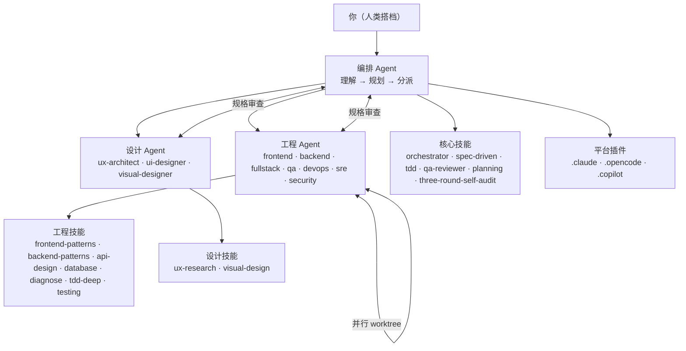

# AI 开发团队框架

一套完整的 AI 软件开发团队框架，适用于 **VS Code Copilot**、**OpenCode**、**Claude Code** 及任何兼容 Claude/MCP 的开发工具。

灵感来源：[superpowers](https://github.com/obra/superpowers) · [OpenSpec](https://github.com/Fission-AI/OpenSpec) · [mattpocock/skills](https://github.com/mattpocock/skills) · [agency-agents](https://github.com/msitarzewski/agency-agents) · [Aperant](https://github.com/AndyMik90/Aperant)

## 是什么

**编排优先（Orchestrator-First）** 的 AI 开发团队：一个协调 Agent 负责理解任务、拆解工作流，然后将任务分派给专业工程 Agent 和设计 Agent，在平行的 git worktree 中并行执行，全流程遵循"先规格再代码"的工作流，并内置 QA 质量门禁。

## 架构图



### 核心原则：编排优先

编排 Agent **永远不直接写代码**。它只做三件事：拆解（decompose）、分派（delegate）、审查（review）。

## 快速上手

```bash
# 将框架克隆到项目中
git clone https://github.com/YOUR_USER/ai-dev-team-framework.git .ai-dev-team

# 运行安装脚本
cd .ai-dev-team && ./scripts/install.sh
```

或者直接将 `.claude/`、`.opencode/` 或 `.copilot/` 目录复制到你的项目根目录。

## 目录结构

```
ai-dev-team-framework/
├── README.md                      # 英文版说明
├── README_zh.md                  # 本文件（中文版）
├── CLAUDE.md                      # AI 编码 Agent 的工作指南
├── AGENTS.md                      # Agent 之间协作的协议定义
├── skills/                        # 技能库（Composable Skills）
│   ├── core/                      # 核心工作流技能
│   │   ├── orchestrator/          # 编排者角色定义
│   │   ├── spec-driven/           # 规格驱动开发
│   │   ├── subagent-driven/       # 子 Agent 分派模式
│   │   │   └── SKILL.md          # ← 真实 superpower 内容（12k chars）
│   │   ├── tdd/                  # 测试驱动开发（Iron Law）
│   │   │   └── SKILL.md          # ← 真实 superpower 内容（9.8k chars）
│   │   ├── systematic-debugging/  # 4 阶段根因调试
│   │   ├── qa-reviewer/          # QA 质量门禁
│   │   ├── planning/              # 任务分解
│   │   ├── three-round-self-audit/ # 交付前三省吾身
│   │   └── ...                   # 17 个核心技能
│   ├── engineering/               # 工程技能（来自 mattpocock/skills + 自研）
│   │   ├── diagnose/             # ← 真实 mattpocock 内容（7.1k chars）
│   │   ├── tdd-deep/            # ← 真实 mattpocock 内容 + 5 个 ref 文件
│   │   ├── improve-codebase-architecture/ # ← 真实 mattpocock 内容 + 3 refs
│   │   ├── frontend-patterns/    # React/Vue 组件模式
│   │   ├── backend-patterns/    # API 设计 + 数据库模式
│   │   ├── api-design/          # RESTful / GraphQL 设计规范
│   │   ├── database-patterns/   # 索引策略、事务边界
│   │   └── devops-patterns/     # CI/CD、容器化
│   └── design/                   # 设计技能
│       ├── ux-research/         # 用户研究方法、人物画像
│       └── visual-design/       # 色彩理论、字体排版、布局原则
├── agents/                       # Agent 定义库
│   ├── engineering/              # 工程 Agent（来自 agency-agents）
│   │   ├── frontend-developer/
│   │   ├── backend-developer/
│   │   ├── fullstack-developer/
│   │   ├── qa-engineer/
│   │   ├── devops-engineer/
│   │   ├── security-engineer/
│   │   └── sre/
│   └── design/                  # 设计 Agent（来自 agency-agents）
│       ├── ux-architect/
│       ├── ui-designer/
│       └── visual-designer/
├── specs/                       # 规格模板（OpenSpec 风格）
│   └── templates/
├── .claude/                     # Claude Code 插件
├── .opencode/                   # OpenCode 插件
├── .copilot/                    # VS Code Copilot 插件
├── .ai-dev/                     # 框架自身维护规范
│   ├── CHANGES.md               # 变更日志
│   └── specs/                   # 框架自身重构规格
└── scripts/
    ├── install.sh               # 跨平台安装脚本
    └── test-structure.sh        # 框架结构验证（0 errors, 0 warnings）
```

## 核心工作流

### 五阶段流水线

```
1. ORCHESTRATE（编排）  ← 理解任务，评估复杂度，分配角色
           ↓
2. SPEC（规格）         ← 编写规格文档（OpenSpec 风格）
           ↓
3. PLAN（规划）          ← 将规格拆解为独立任务
           ↓
4. BUILD（构建）         ← 子 Agent 在并行 worktree 中实现
           ↓
5. QA GATE（质量门禁）   ← QA 审查验证，修复者解决遗留问题
```

### 子 Agent 模式

计划中的每个任务都会获得一个**全新的子 Agent**，具备：

- **隔离的上下文**（不继承编排者的会话历史）
- **完整的任务目标 + 验收标准**
- **加载对应的技能文档**
- **两阶段审查**：规格合规 → 代码质量

## 工程 Agent

| Agent | 专长 | 适用场景 |
|-------|------|---------|
| `frontend-developer` | React/Vue/HTML-CSS | UI 功能、响应式组件 |
| `backend-developer` | APIs、数据库、服务 | 服务端逻辑、数据管道 |
| `fullstack-developer` | 端到端功能 | API + UI 一体化需求 |
| `qa-engineer` | 测试策略、自动化 | 测试套件、E2E、覆盖率 |
| `devops-engineer` | CI/CD、基础设施 | 部署、流水线、容器化 |
| `security-engineer` | 安全审计、威胁建模 | 安全审查、渗透测试 |
| `sre` | 可靠性、监控 | SLO/SLI、告警、容灾 |

## 设计 Agent

| Agent | 专长 | 适用场景 |
|-------|------|---------|
| `ux-architect` | 用户研究、信息架构 | 线框图、流程图、人物画像 |
| `ui-designer` | 视觉组件、设计系统 | UI 规范、组件库 |
| `visual-designer` | 图形、品牌、插画 | 图标、品牌视觉 |

## 技能库（Composable Units）

核心技能与工具无关，适用于任何 AI 编码工具：

| 技能 | 用途 | 使用时机 |
|------|------|---------|
| `orchestrator` | 中心协调逻辑 | 每个任务 |
| `spec-driven` | 规格编写与审查 | 新功能、重构 |
| `subagent-driven` | 如何分派子 Agent | 并行工作 |
| `tdd` | 测试优先开发 | 所有实现 |
| `qa-reviewer` | 验证质量门禁 | 每个任务完成后 |
| `planning` | 任务分解 | 规划阶段 |
| `three-round-self-audit` | 交付前自检 | 交付前 |

## 多平台支持

### Claude Code

```bash
# 本地测试（从项目目录运行）
claude --plugin-dir ./ai-dev-team-framework/.claude

# 发布到 marketplace 供团队使用
# 详见：https://code.claude.com/docs/en/plugins
```

`.claude/` 目录包含完整的 Claude Code 插件，提供斜杠命令
(`/orchestrator`、`/spec`、`/qa`、`/audit`)，技能定义引用父框架的 `skills/core/` 内容。

### VS Code Copilot

`.copilot/` 目录提供 VS Code Copilot Agent 插件（预览功能）。

```bash
# 复制到目标项目根目录（本地开发/测试）
cp -r .copilot/ /path/to/your-project/.copilot
```

需要启用 VS Code Copilot Agent 模式，且组织设置中 `chat.plugins.enabled` 已开启。

插件清单：`.copilot/.claude-plugin/plugin.json`

### OpenCode

`.opencode/` 通过 **JavaScript 插件**和 **Markdown 命令文件**提供 OpenCode CLI 集成。

```bash
# 方式一：项目级（推荐）
cp -r .opencode/ /path/to/your-project/

# 方式二：全局安装
cp -r .opencode/ ~/.config/opencode/
```

**可用命令**（安装后）：`/orchestrator`、`/spec`、`/plan`、`/build`、`/qa`、`/audit`

OpenCode 插件格式：JavaScript 模块位于 `.opencode/plugins/`，Markdown 命令文件位于 `.opencode/commands/`。插件还注册了自定义工具：`ai-dev-team.list-skills`、`ai-dev-team.read-skill`、`ai-dev-team.read-agent`、`ai-dev-team.list-specs`。

详见 `.opencode/SKILL.md`。

## 与其他框架的对比

| 维度 | 本框架 | agency-agents | superpower | OpenSpec |
|------|--------|-------------|-----------|----------|
| 定位 | 完整团队模拟 | Agent 角色定义 | 技能驱动工作流 | 规格文档规范 |
| 编排方式 | 编排优先 | 固定角色 | 分派器 | 计划驱动 |
| 技能系统 | 可组合 SKILL.md | 无 | Superpowers | 无 |
| 平台插件 | Claude/OpenCode/Copilot | 仅 CLI | VS Code | 任意 |
| 质量门禁 | 内置三省吾身审计 | 手动 | Verification 技能 | Review 步骤 |
| git worktree | 第一等公民 | 否 | 是 | 否 |

## 贡献指南

详见 [CLAUDE.md](CLAUDE.md)。对人类贡献者的要求：

1. **添加技能** → `skills/<分类>/<名称>/SKILL.md`，包含 YAML frontmatter
2. **添加 Agent** → `agents/<领域>/<名称>/AGENT.md`，包含 YAML frontmatter
3. **验证格式** → `./scripts/test-structure.sh`（必须通过：0 errors）
4. **记录变更** → 在 `.ai-dev/CHANGES.md` 中添加条目

## 许可

MIT
