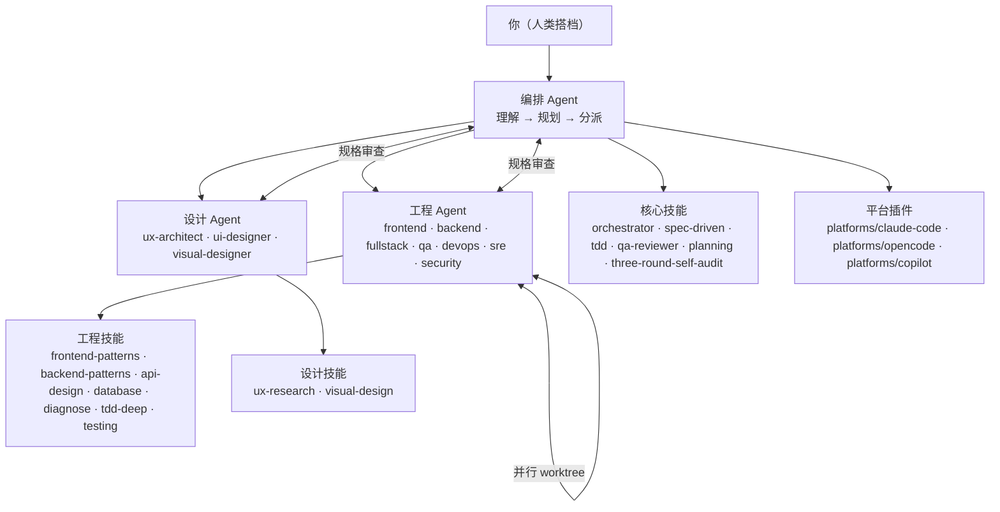

# AI 开发团队框架

一套完整的 AI 软件开发团队框架，适用于 **VS Code Copilot**、**OpenCode**、**Claude Code** 及任何兼容 Claude/MCP 的开发工具。

灵感来源：[superpowers](https://github.com/obra/superpowers) · [OpenSpec](https://github.com/Fission-AI/OpenSpec) · [mattpocock/skills](https://github.com/mattpocock/skills) · [agency-agents](https://github.com/msitarzewski/agency-agents) · [Aperant](https://github.com/AndyMik90/Aperant)

## 是什么

**编排优先（Orchestrator-First）** 的 AI 开发团队：一个协调 Agent 负责理解任务、拆解工作流，然后将任务分派给专业工程 Agent 和设计 Agent，在平行的 git worktree 中并行执行，全流程遵循"先规格再代码"的工作流，并内置 QA 质量门禁。

## 架构图



### 核心原则：编排优先

编排 Agent **永远不直接写代码**。它只做三件事：拆解（decompose）、分派（delegate）、审查（review）。

## 目录结构

```
ai-dev-team-framework/
├── README.md                      # 英文版说明
├── README_zh.md                  # 本文件（中文版）
├── CLAUDE.md                      # AI 编码 Agent 的工作指南
├── AGENTS.md                      # Agent 之间协作的协议定义
├── skills/                        # 与工具无关的技能定义
│   ├── core/                      # 核心工作流技能
│   ├── engineering/               # 工程技能
│   ├── design/                    # 设计技能
│   └── mattpocock/               # 上游集成清单
├── agents/                        # Agent 定义
│   ├── orchestrator/
│   ├── engineering/
│   └── design/
├── specs/
│   └── templates/
├── platforms/                    # 工具专属集成（完全隔离，无交叉污染）
│   ├── claude-code/              # Claude Code 插件
│   ├── copilot/                  # VS Code Copilot 插件
│   └── opencode/                 # OpenCode 插件
├── .ai-dev/                      # 框架自身维护
└── scripts/
    ├── install.sh
    └── test-structure.sh         # YAML frontmatter 验证（0 errors）
```

## 快速上手

每个平台都有独立的集成，见下方各章节。

## 核心工作流

### 五阶段流水线

```
1. ORCHESTRATE（编排）  ← 理解任务，评估复杂度，分配角色
           ↓
2. SPEC（规格）         ← 编写规格文档（OpenSpec 风格）
           ↓
3. PLAN（规划）          ← 将规格拆解为独立任务
           ↓
4. BUILD（构建）         ← 子 Agent 在并行 worktree 中实现
           ↓
5. QA GATE（质量门禁）   ← QA 审查验证，修复者解决遗留问题
```

### 子 Agent 模式

计划中的每个任务都会获得一个**全新的子 Agent**，具备：
- **隔离的上下文**（不继承编排者的会话历史）
- **完整的任务目标 + 验收标准**
- **加载对应的技能文档**
- **两阶段审查**：规格合规 → 代码质量

## 工程 Agent

| Agent | 专长 | 适用场景 |
|-------|------|---------|
| `frontend-developer` | React/Vue/HTML-CSS | UI 功能、响应式组件 |
| `backend-developer` | APIs、数据库、服务 | 服务端逻辑、数据管道 |
| `fullstack-developer` | 端到端功能 | API + UI 一体化需求 |
| `qa-engineer` | 测试策略、自动化 | 测试套件、E2E、覆盖率 |
| `devops-engineer` | CI/CD、基础设施 | 部署、流水线、容器化 |

## 设计 Agent

| Agent | 专长 | 适用场景 |
|-------|------|---------|
| `ux-architect` | 用户研究、信息架构 | 线框图、流程图、人物画像 |
| `ui-designer` | 视觉组件、设计系统 | UI 规范、组件库 |
| `visual-designer` | 图形、品牌、插画 | 图标、品牌视觉 |

## 技能库（Composable Units）

核心技能与工具无关，适用于任何 AI 编码工具：

| 技能 | 用途 | 使用时机 |
|------|------|---------|
| `orchestrator` | 中心协调逻辑 | 每个任务 |
| `spec-driven` | 规格编写与审查 | 新功能、重构 |
| `subagent-driven` | 如何分派子 Agent | 并行工作 |
| `tdd` | 测试优先开发 | 所有实现 |
| `qa-reviewer` | 验证质量门禁 | 每个任务完成后 |
| `planning` | 任务分解 | 规划阶段 |
| `three-round-self-audit` | 交付前自检 | 交付前 |

## 多平台支持

每个平台在 `platforms/<name>/` 中完全隔离，互不污染。

### Claude Code

```bash
# 项目级
cp -r platforms/claude-code/skills/ /path/to/project/.claude/skills/ai-dev-team/

# 或运行安装脚本
./platforms/claude-code/install.sh /path/to/project
```

Skills 从 `~/.claude/skills/` 自动发现。详见 `platforms/claude-code/SKILL.md`。

### VS Code Copilot

```bash
# 项目级
cp -r platforms/copilot/commands/ /path/to/project/.claude/
cp -r platforms/claude-code/skills/ /path/to/project/.claude/skills/ai-dev-team/

# 或运行安装脚本
./platforms/copilot/install.sh /path/to/project
```

VS Code Copilot 从 `.claude/skills/`（项目级）或 `~/.claude/skills/`（用户级）自动发现 Agent Skills。详见 `platforms/copilot/SKILL.md`。

### OpenCode

```bash
# 项目级
cp -r platforms/opencode/. /path/to/project/.opencode/

# 或运行安装脚本
./platforms/opencode/install.sh /path/to/project
```

**可用命令：** `/orchestrator`、`/spec`、`/plan`、`/build`、`/qa`、`/audit`、`/agent`

详见 `platforms/opencode/SKILL.md`。

## 与其他框架的对比

| 维度 | 本框架 | agency-agents | superpower | OpenSpec |
|------|--------|-------------|-----------|----------|
| 定位 | 完整团队模拟 | Agent 角色定义 | 技能驱动工作流 | 规格文档规范 |
| 编排方式 | 编排优先 | 固定角色 | 分派器 | 计划驱动 |
| 技能系统 | 可组合 SKILL.md | 无 | Superpowers | 无 |
| 平台插件 | `platforms/` 隔离目录 | 仅 CLI | VS Code | 任意 |
| 质量门禁 | 内置三省吾身审计 | 手动 | Verification 技能 | Review 步骤 |
| git worktree | 第一等公民 | 否 | 是 | 否 |

## 贡献指南

详见 [CLAUDE.md](CLAUDE.md)。对人类贡献者的要求：

1. **添加技能** → `skills/<分类>/<名称>/SKILL.md`，包含 YAML frontmatter
2. **添加 Agent** → `agents/<领域>/<名称>/AGENT.md`，包含 YAML frontmatter
3. **添加平台插件** → `platforms/<名称>/`（完全隔离）
4. **验证格式** → `./scripts/test-structure.sh`（必须通过：0 errors）
5. **记录变更** → 在 `.ai-dev/CHANGES.md` 中添加条目

## 许可

MIT